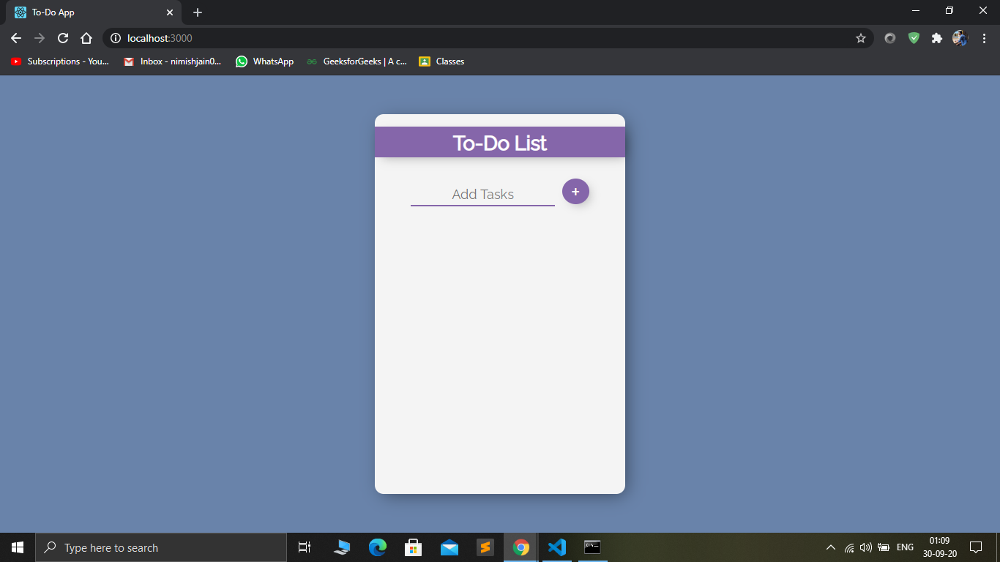
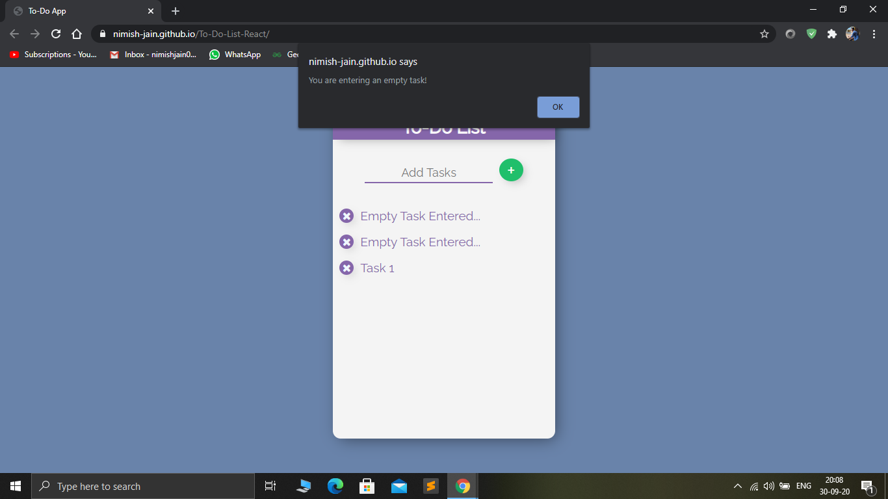
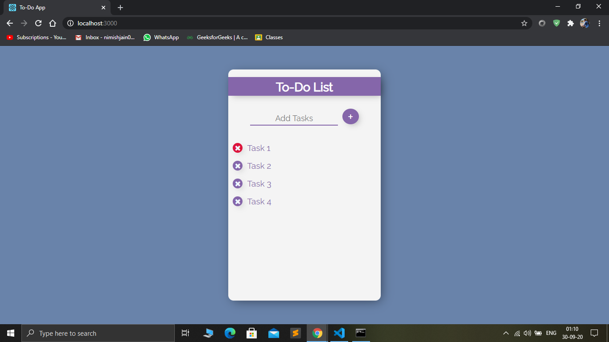

# To-Do-List-React

A simple To-Do List App created using React JS. This app is built using the concept of Components, Props, Hooks, and several other concepts of React JS & ES6.
This gives a very good idea for implementation of the concepts learnt in React JS.

Try the app at the following link : https://nimish-jain.github.io/To-Do-List-React/

